# Workshop-3-Wiki

## Integrantes

Ivan Alejandro Gutierrez Espinosa

Cesar Felipe Giraldo Mora

## Introducción

Este proyecto tiene como objetivo explorar la aplicación de la automatización industrial en el monitoreo de niveles de líquidos químicos dentro de tanques de almacenamiento. A través del uso de sensores, lógica Ladder (LD) y controladores lógicos programables (PLC), se busca diseñar un sistema capaz de supervisar de manera eficiente los niveles de líquido, reduciendo el consumo energético y minimizando el desperdicio de sustancias químicas.

Este tipo de soluciones es ampliamente utilizado en la industria química y de procesos, donde mantener un control preciso sobre los niveles de tanques resulta crítico para la seguridad, la sostenibilidad y la eficiencia operativa. A lo largo del desarrollo de este proyecto, se implementarán conceptos clave de programación PLC y lógica de control para construir un sistema automatizado que reaccione de forma inteligente a los cambios detectados por los sensores, activando señales de advertencia ante fallos o condiciones anómalas.

## Planteamiento y Diseño del Circuito

Con base en los datos proporcionados por el docente, el primer paso fue elaborar una tabla de verdad que incluyera todas las posibles combinaciones de entradas (inputs), junto con la salida (output) correspondiente para cada caso, de acuerdo con la lógica de funcionamiento del sistema. Dicha tabla se presenta a continuación:

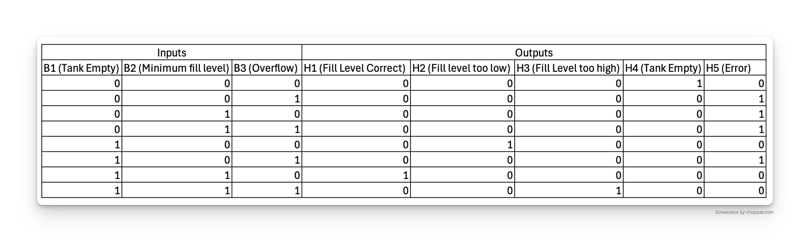

Una vez construida la tabla de verdad, utilizamos una calculadora en línea de Mapas de Karnaugh para simplificar las expresiones lógicas correspondientes a cada una de las salidas (outputs). A partir de estas simplificaciones, obtuvimos los diagramas lógicos optimizados para el diseño del circuito. A continuación, se presentan dichos diagramas organizados en el siguiente orden: H1, H2, H3, H4 y H5.

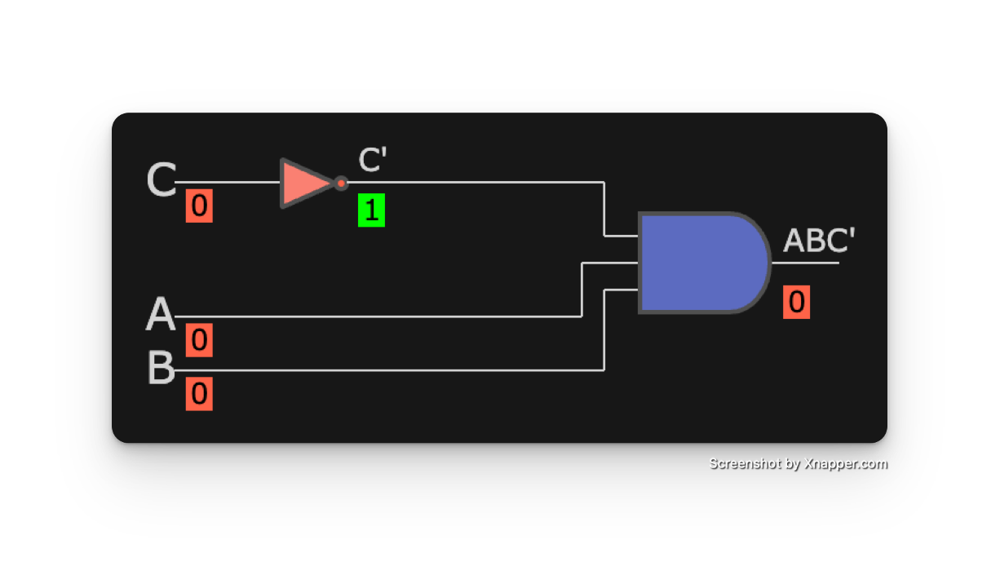
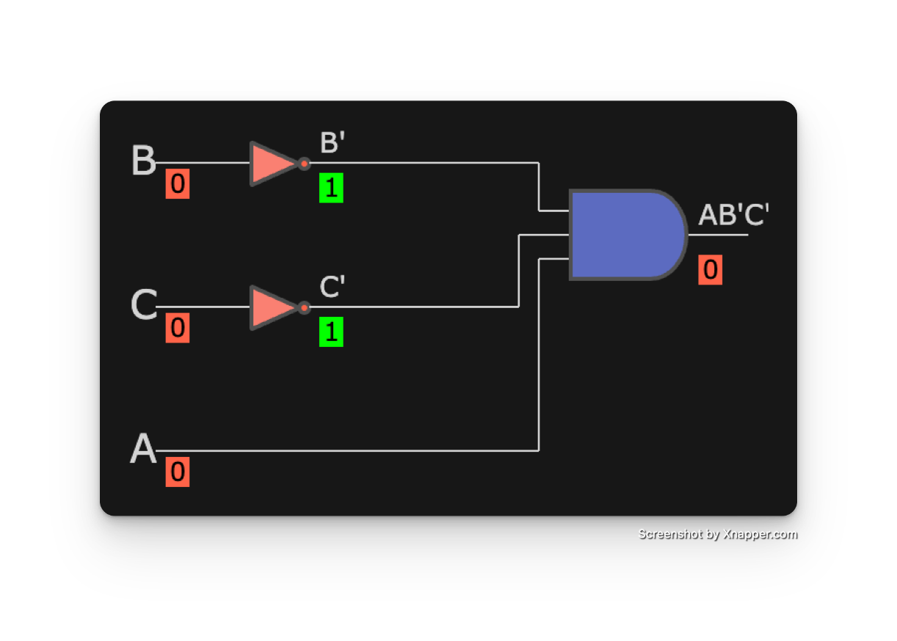

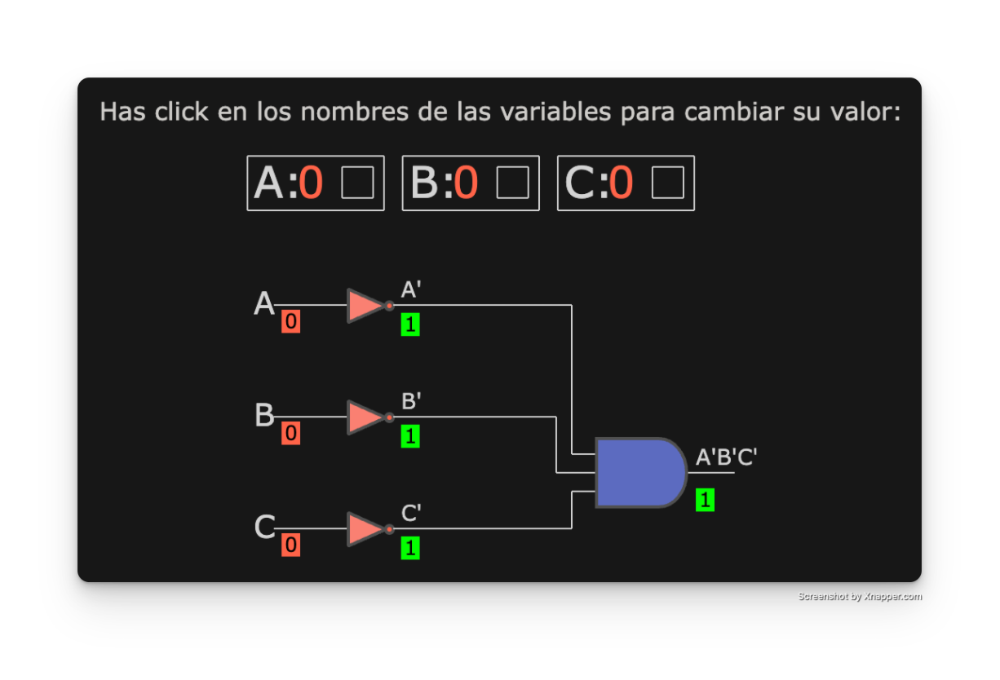
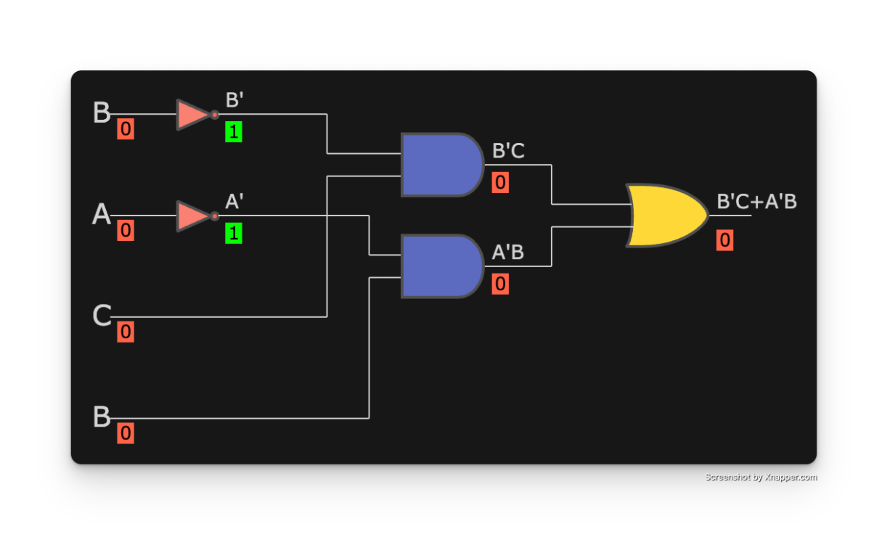

## CodeSys
Una vez contabamos con los diagramas logicos, se realizó la implementación y simulación del diseño usado CODESYS, para este apartado se realizaron las actividades de el esquemático del Ladder y luego la simulación del mismo con un HMI que muestre su funcionamiento a través de una animación.

### Esquemático Ladder del diseño
Una vez estamos en el software en el plano PLC_PRG se añadió el primer contacto para habilitar la pestaña de variables globales y asi crear todas las variables requeridad en el ejercicio.

Con las variables configuradas en el CODESYS se construyó el esquemático siguiendo los procesos definidos en los diagramas logicos, para este se realizaron un total de 8 redes para el completo funcionamiento tanto para la lógica como para el HMI que sera implementado más adelante.

Las primeras 3 redes se usaron como recoils de las señales negadas de los sensores B1, B2 y B3, esto con el fin de simplificar la implementación ladder de cada uno de los circuitos lógicos en el sistema.

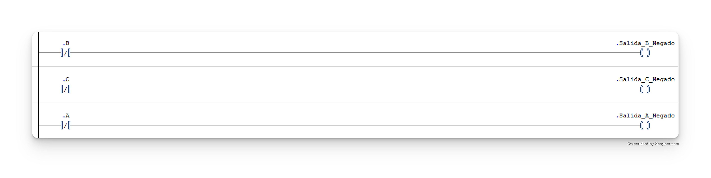

Finalmentes, las redes 4, 5, 6, 7 y 8 se usaron para implentar la logica ladder de los diagramas logicos para los outputs H1, H2, H3, H4 Y H5 respectivamente, asi como muestra la imagen a continuación

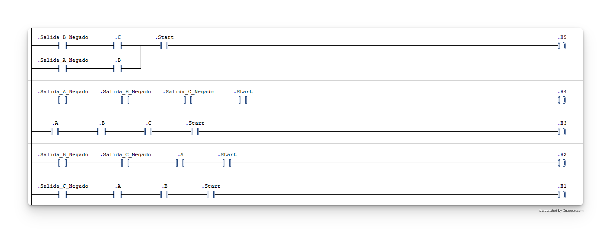

### Simulación con un HMI 

Una vez el esquemático del Ladder estaba listo, se agrego un objeto de visualización para el diseño de la simulación con uso de un HMI (Interfaz Hombre-Maquina) el cual consiste en una interfaz para demostrar como sería el funcionamiento de la solución y como una persona interactúa con este mismo. 

Debido al contexto del problema, donde buscabamos mandar una alerta con base al nivel de un liquido detectado mediante sensores, se deicido emplear botones como actuadores para reemplazar la funcionalidad de los sensores debido a la limitante de que CodeSys no cuenta con esta opción. De igual modo se incluyo una animación que mostrara un nivel del agua simulado con base al nivel de liquido detectado, es decir los botones accionados.

## OpenPLC

### Implementación

Para la implementación del proyecto utilizando OpenPLC y Codesys, se llevaron a cabo las siguientes acciones:

1. **Definición de lógicas combinacionales**:  
   Se emplearon contactos en Codesys para diseñar las lógicas combinacionales individualmente. Esto permitió un análisis profundo del comportamiento lógico, facilitando su comprensión y depuración.

   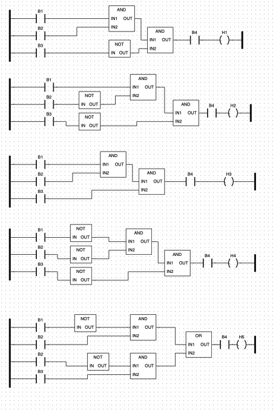

   *Figura 1: Diagrama de lógicas combinacionales implementadas en Codesys.*

2. **Asignación de direcciones físicas**:  
   Se definieron las direcciones físicas para las entradas y salidas siguiendo el estándar IEC 61131-3. Las entradas digitales fueron configuradas desde `%IX0.0` hasta `%IX0.3`, mientras que las salidas digitales fueron configuradas desde `%QX0.0` hasta `%QX0.4`.  
   
   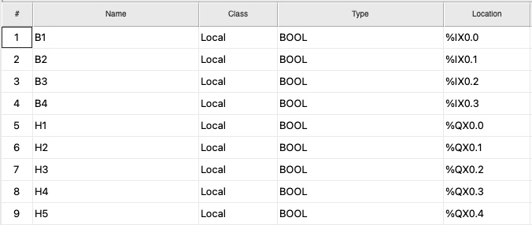

   *Figura 2: Tabla de direccionamiento físico utilizada en OpenPLC.*

### Pruebas

Para garantizar la funcionalidad y confiabilidad del sistema, se realizaron pruebas exhaustivas que incluyeron:

#### 1. Verificación de lógicas combinacionales
Se validaron individualmente las lógicas implementadas mediante simulaciones y pruebas específicas, para asegurar que coincidieran exactamente con el comportamiento esperado.

#### 2. Validación del direccionamiento físico
Se confirmó que cada entrada y salida definida correspondiera correctamente al hardware conectado, asegurando una interacción precisa con los sensores y actuadores físicos.

#### 3. Montaje físico y pruebas mediante conexión serial (Arduino)
Se llevó a cabo un montaje físico, empleando diversas placas Arduino Uno, estableciendo una conexión serial mediante protocolo **Modbus RTU** con una velocidad de comunicación (baudrate) de **115200 baudios**.

- **Configuración de los pines digitales del Arduino**:
  - **Entradas digitales**: Pines 2, 3, 4, 5, 6.
  - **Salidas digitales**: Pines 7, 8, 12, 13, 9.

  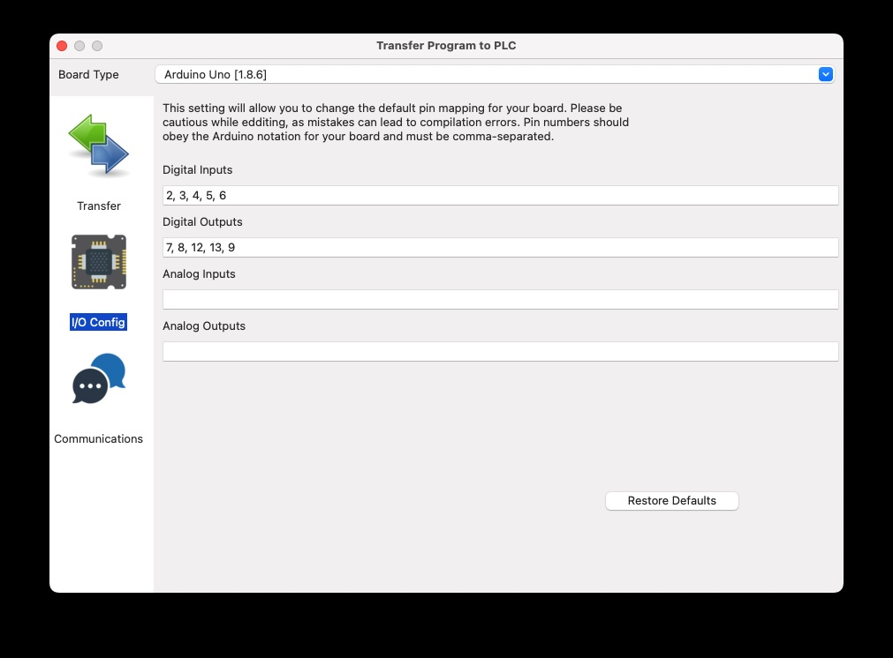
Se uso de un puerto analogico, el nueve, como podemos ver en la imagen, se eliminan todos los demas puertos analogicos planteados para eliminar posibles conflictos en el futuro.
  *Figura 3: Configuración de pines de entrada y salida en OpenPLC para Arduino Uno.*

- **Configuración del protocolo serial Modbus RTU**:
  - Slave ID: `1`
  - Velocidad: `115200` baudios.
  - Interfaz utilizada: `Serial`

  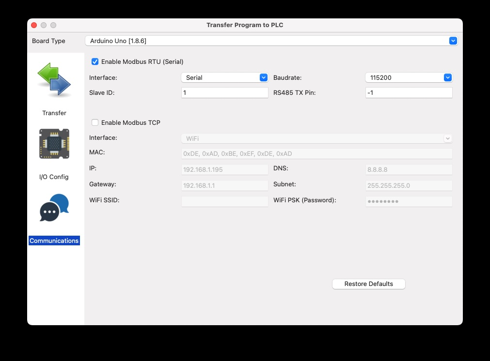

  *Figura 4: Configuración de comunicación serial Modbus RTU.*

- **Configuración del depurador remoto**:
  - Protocolo: `Serial-RTU`
  - Slave ID: `1`
  - Velocidad: `115200` baudios

  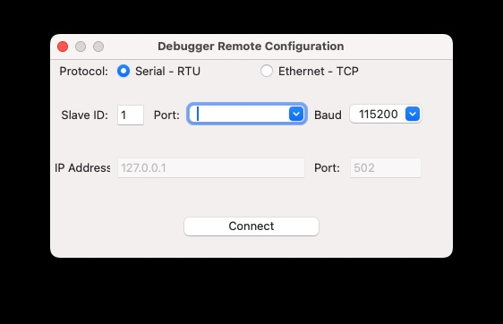

  *Figura 5: Configuración de depuración remota del sistema.*

Durante estas pruebas, surgieron múltiples problemas relacionados con ruido e interferencias en las entradas digitales:

- Se utilizaron diversos pulsadores y dipswitches, incluyendo resistencias **pull-down** de 10 kΩ, pero esto no logró resolver el problema.
- Se verificó el comportamiento lógico mediante la conexión serial, descartando errores en el código o en la lógica cargada en el Arduino.
- Finalmente, se concluyó que la fuente del problema podría radicar en:
  - La calidad o conexiones internas de la protoboard utilizada.
  - Fallas o defectos en los pines de entrada del Arduino.
  - Interferencias electromagnéticas por cableado o ambiente.

