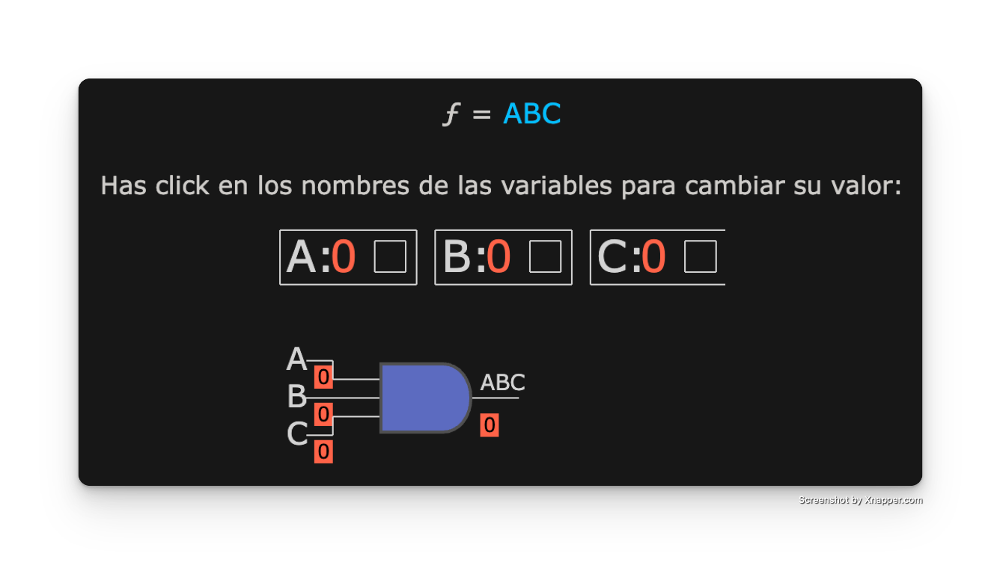

# Workshop-3-Wiki

## Integrantes

Ivan Alejandro Gutierrez Espinosa

Cesar Felipe Giraldo Morat

## Introducción

Este proyecto tiene como objetivo explorar la aplicación de la automatización industrial en el monitoreo de niveles de líquidos químicos dentro de tanques de almacenamiento. A través del uso de sensores, lógica Ladder (LD) y controladores lógicos programables (PLC), se busca diseñar un sistema capaz de supervisar de manera eficiente los niveles de líquido, reduciendo el consumo energético y minimizando el desperdicio de sustancias químicas.

Este tipo de soluciones es ampliamente utilizado en la industria química y de procesos, donde mantener un control preciso sobre los niveles de tanques resulta crítico para la seguridad, la sostenibilidad y la eficiencia operativa. A lo largo del desarrollo de este proyecto, se implementarán conceptos clave de programación PLC y lógica de control para construir un sistema automatizado que reaccione de forma inteligente a los cambios detectados por los sensores, activando señales de advertencia ante fallos o condiciones anómalas.

## Planteamiento y Diseño del Circuito

Con base en los datos proporcionados por el docente, el primer paso fue elaborar una tabla de verdad que incluyera todas las posibles combinaciones de entradas (inputs), junto con la salida (output) correspondiente para cada caso, de acuerdo con la lógica de funcionamiento del sistema. Dicha tabla se presenta a continuación:

Una vez construida la tabla de verdad, utilizamos una calculadora en línea de Mapas de Karnaugh para simplificar las expresiones lógicas correspondientes a cada una de las salidas (outputs). A partir de estas simplificaciones, obtuvimos los diagramas lógicos optimizados para el diseño del circuito. A continuación, se presentan dichos diagramas organizados en el siguiente orden: H1, H2, H3, H4 y H5.

## CodeSys
Una vez contabamos con los diagramas logicos, se realizó la implementación y simulación del diseño usado CODESYS, para este apartado se realizaron las actividades de el esquemático del Ladder y luego la simulación del mismo con un HMI que muestre su funcionamiento a través de una animación.

### Esquemático Ladder del diseño
Una vez estamos en el software en el plano PLC_PRG se añadió el primer contacto para habilitar la pestaña de variables globales y asi crear todas las variables requeridad en el ejercicio.

Con las variables configuradas en el CODESYS se construyó el esquemático siguiendo los procesos definidos en los diagramas logicos, para este se realizaron un total de 23 redes para el completo funcionamiento tanto para la lógica como para el HMI que sera implementado más adelante. 
